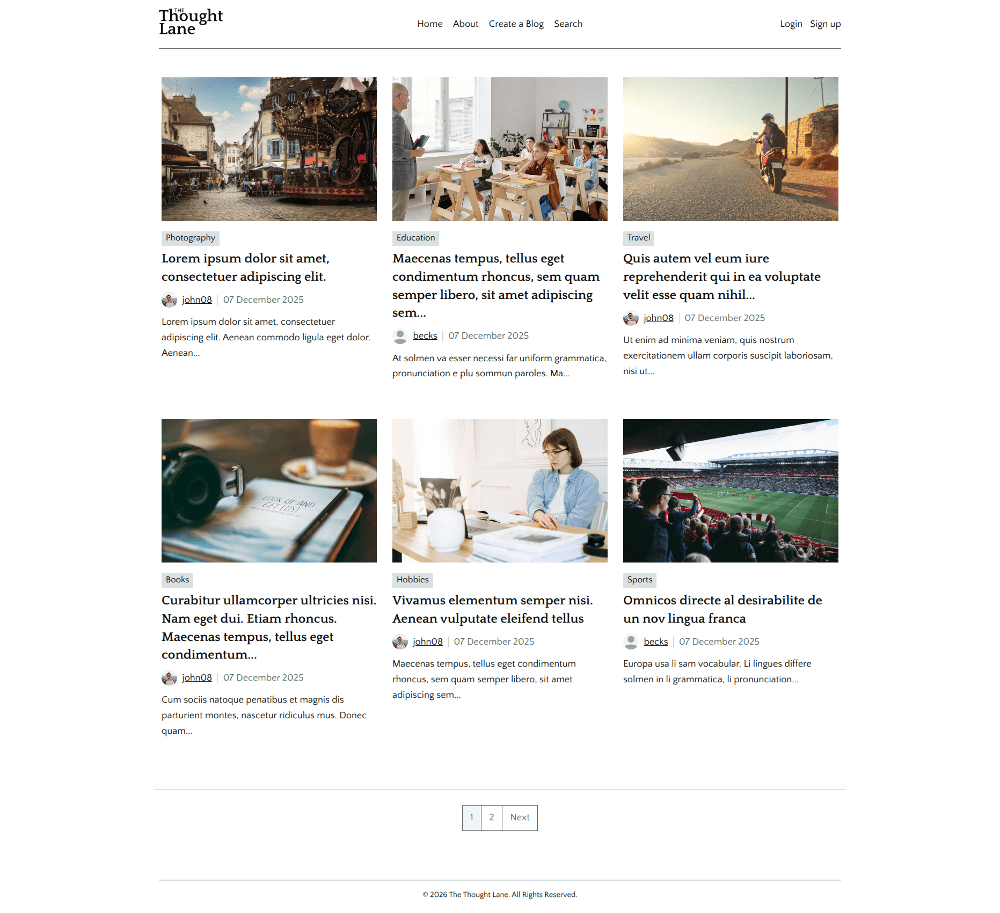
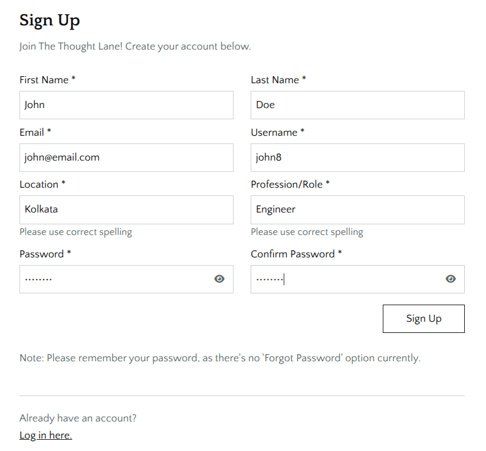
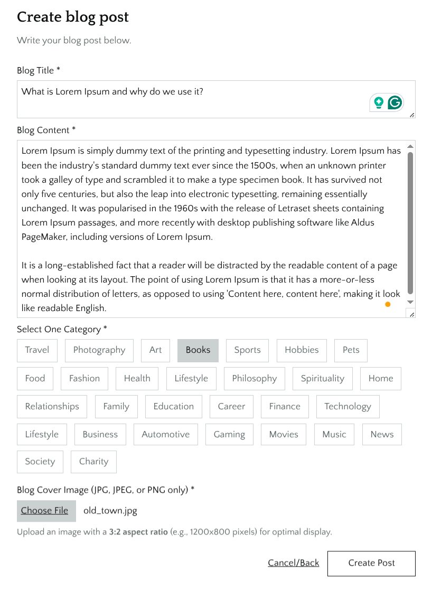
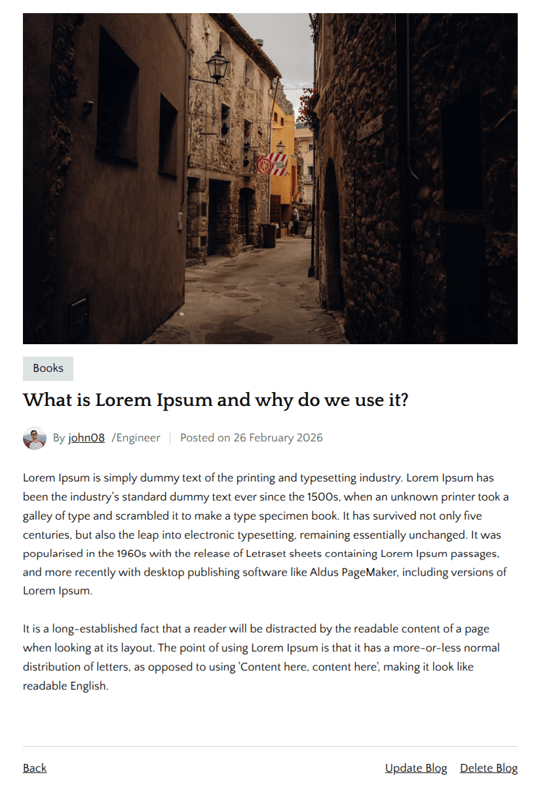
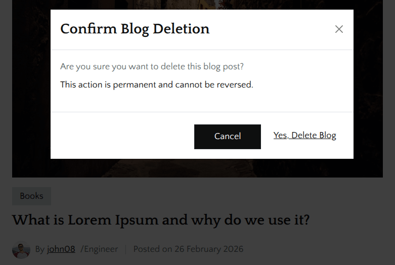
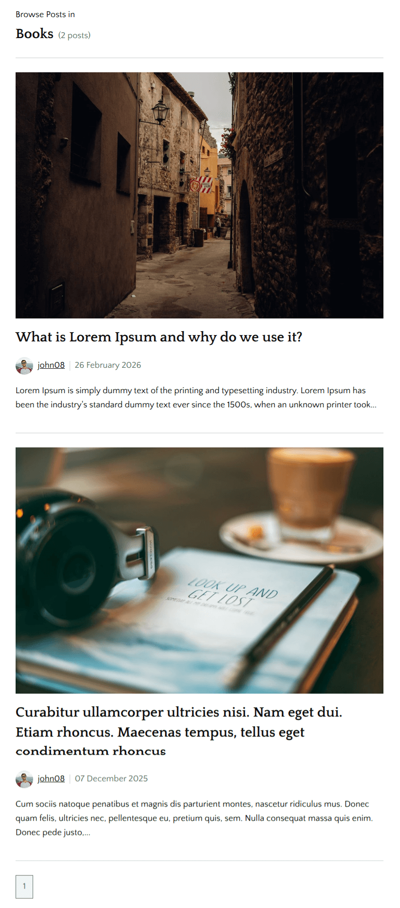
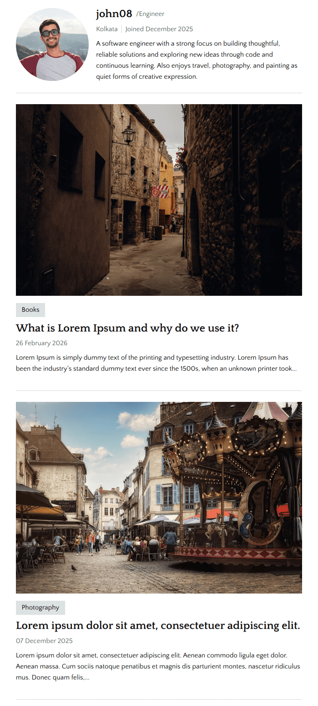
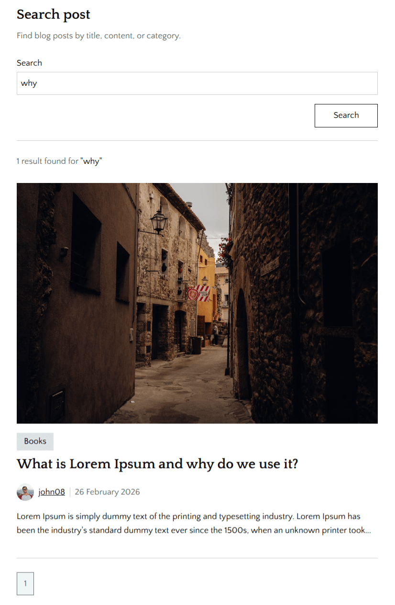
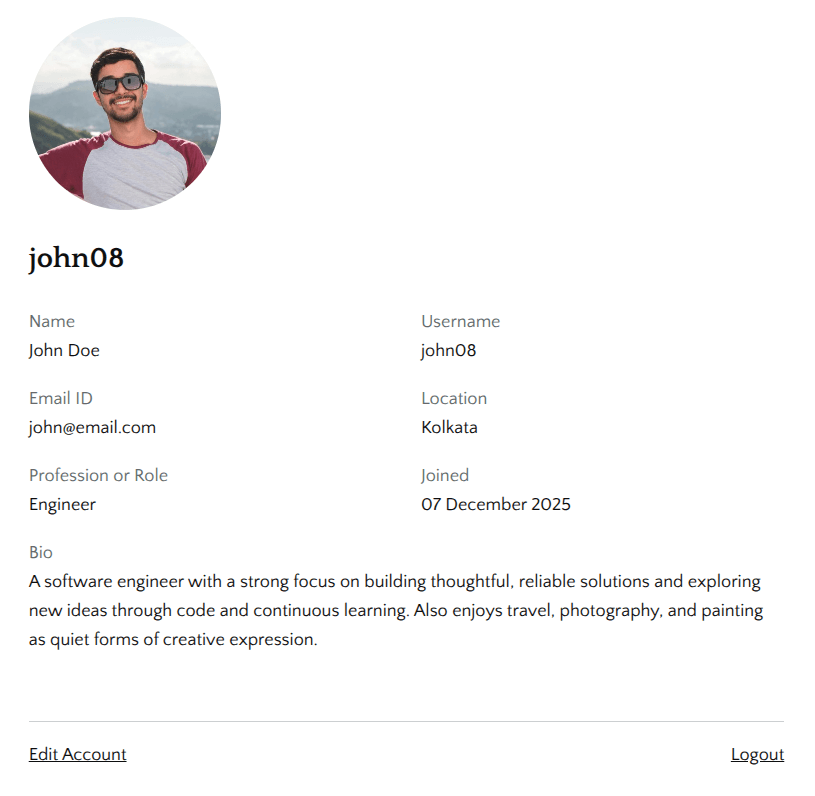
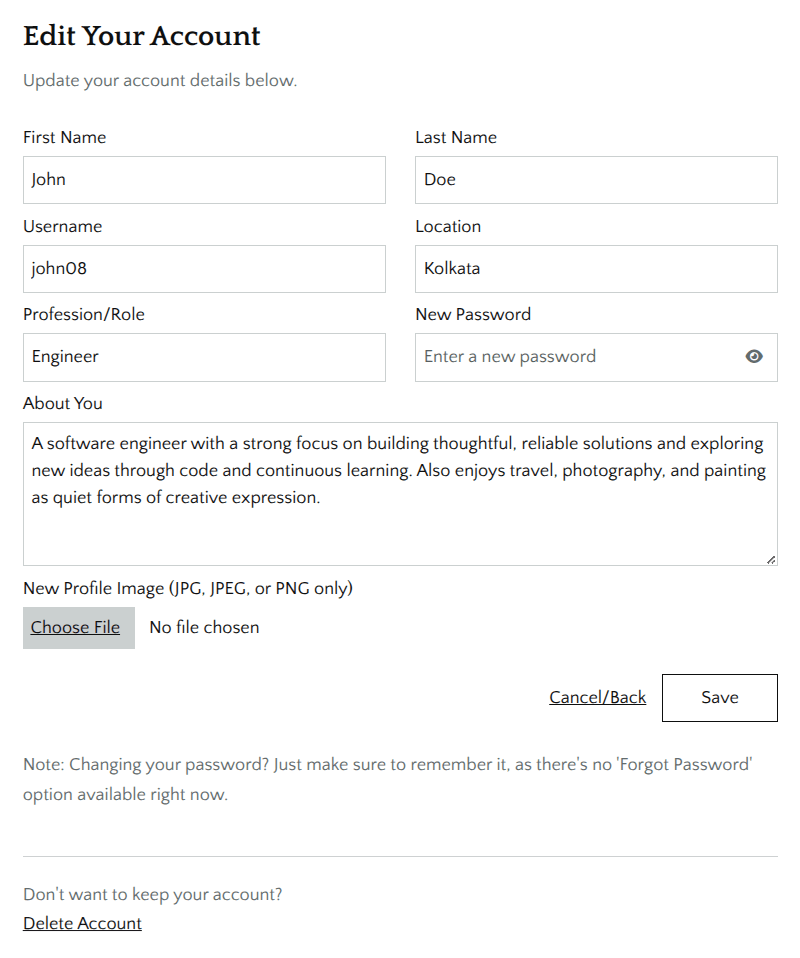

# The Thought Lane – A Blogging Platform Built With Flask & MySQL
The Thought Lane is a feature-rich blogging platform built using Flask, MySQL, and SQLAlchemy.
It allows users to create accounts, write blogs, upload cover images, browse posts by categories, search content, and manage their own profiles — all wrapped in a clean and minimalist UI.


---

## Features
- Create, view, update, and delete blog posts
- User authentication with signup and login
- Category filtering to browse posts by interest
- Search posts by title, content, or category
- Pagination for browsing posts smoothly
- User profile page with editable account details and avatar placeholder
- Clean UI with a focus on readability and a pleasant writing experience

## Technologies
- **Backend:** Python, Flask, SQLAlchemy
- **Frontend:** HTML, CSS, Bootstrap
- **Database:** MySQL

<hr>

## Screenshots

**Sign Up Page:** User registration form with unique username and email validation.


---


**Create New Blog Post:** Blog creation form featuring category selection and image upload support.


---


**Single Blog Post View:** Displays the full blog post with edit/delete controls for the authenticated author.


---


**Delete Confirmation Modal:** A confirmation popup asking the author to verify before deleting a post.


---


**Category Filter Page:** Lists all posts under a selected category with pagination for smooth navigation.


---


**User Blogs Page:** Shows all blog posts (with pagination) written by a specific user.


---


**Search Results Page:** Displays posts (with pagination) matching the search query across titles, content, and categories.


---


**User Profile Page:** Shows user details with a default avatar, plus options to update the profile or log out.


---


**Edit Profile Page:** Form to update account information with an optional delete-account action.


---


## Setup Instructions
1. **Clone the repository:**
   ```bash
   git clone https://github.com/souviksn91/thought-lane.git
   cd thoughtlane
   ```

2. **Create a virtual environment:**
   ```bash
   python -m venv venv
   source venv/bin/activate  # On Windows: venv\Scripts\activate
   ```

3. **Install dependencies:**
   ```bash
   pip install -r requirements.txt
   ```

4. **Configure database:**
    Create a new database in MySQL and update the credentials in your .env file (refer to DATABASE.md for detailed steps.)

5. **Run the app:**
   ```bash
   python app.py
   ```
6. **Access in browser:**
   http://127.0.0.1:5000/
   